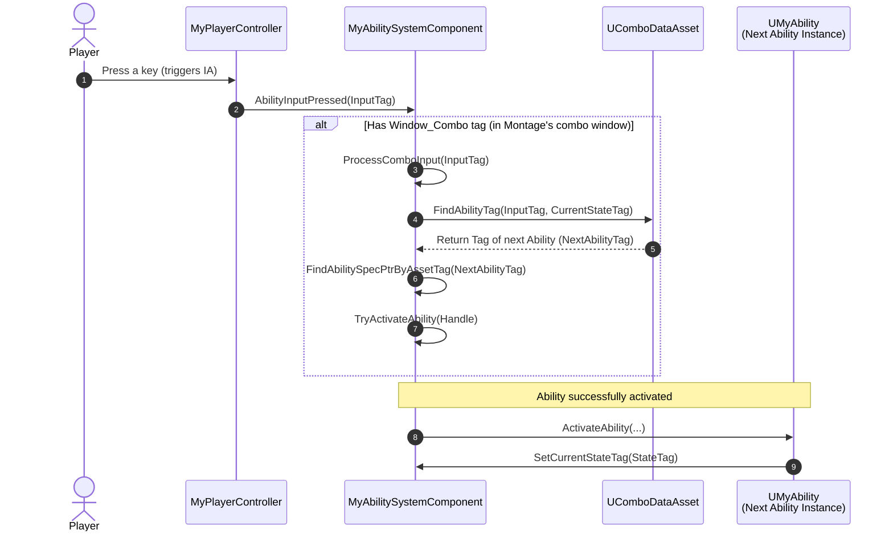
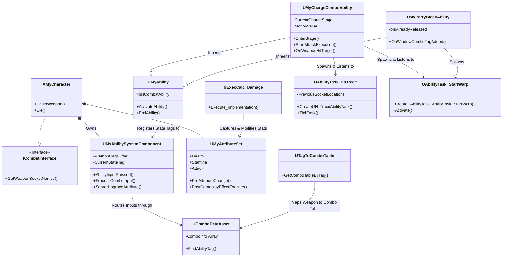
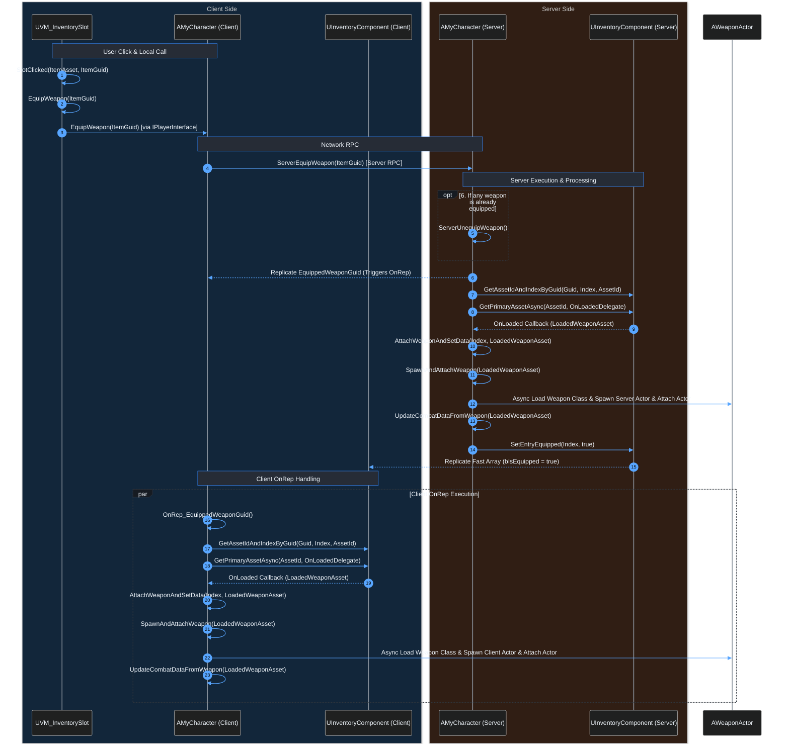
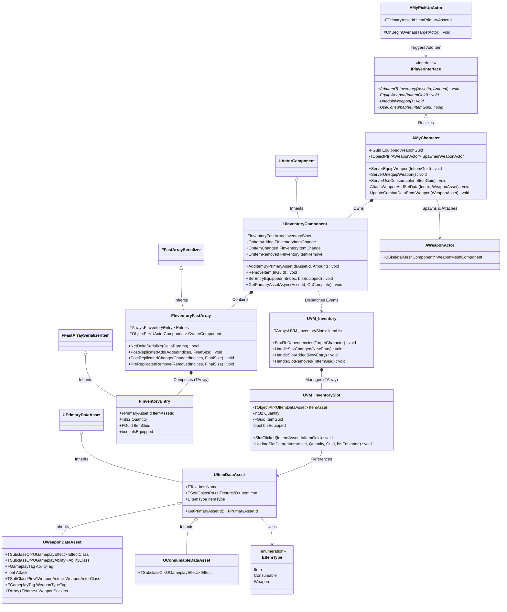

[日本語](README.md) | [English](README.en.md)

---
# [UE5 / C++] Multiplayer Action Game Technical Demo (GAS / MVVM / StateTree / FastArraySerializer)

Designed as a technical demo for PC and console multiplayer action game development, this project natively integrates Unreal Engine 5's core frameworks—Gameplay Ability System (GAS), Model-View-ViewModel (MVVM), and StateTree—entirely in C++.

Beyond standard feature implementation, this demo focuses on crucial non-functional requirements for commercial titles: optimizing network bandwidth via `FastArraySerializer`, achieving low-latency client-authoritative hit detection using `FGameplayAbilityTargetData`, and minimizing runtime overhead through object pooling and an event-driven architecture. By consolidating core logic into C++, this project eliminates Blueprint Virtual Machine execution overhead, demonstrating a highly scalable, loosely coupled architecture alongside a designer-friendly, data-driven workflow.

( [Inventory & Equipment System Sequence Diagram](#-inventory--equipment-system) | [Data-Driven Combo System Sequence Diagram](#️-custom-combo-system) )

<table width="100%">
  <tr>
    <td align="center" width="50%" valign="top">
      <br/>
      <b>Parry → Counter Attack → Charged Attack</b>
    </td>
    <td align="center" width="50%" valign="top">
      <br/>
      <b>Dynamic Combo Table Switching & Motion Warping</b>
    </td>
  </tr>
</table>

---

## **🎮 Project Overview**

* **Engine Version**: Unreal Engine 5.7 (C++)  
* **Genre**: Multiplayer Third-Person Action Game  
* **Target Platforms**: PC / Console  

### 🔑 Tech Stack & Implementation Overview

* **Loosely Coupled Architecture Design**
  * `MVVM` | `Interface (C++)` | `Strategy Pattern (GAS)` | `Observer Pattern (Delegates)` | `SRP` | `Subsystem`
  * **Polymorphic UI Expression via OOP**:
    * Base Enemy Class: Centralized `ViewModel` management.
    * Regular Enemies (Minions): Overhead health bars rendered via `WidgetComponent`.
    * Bosses: Retrieve `ViewModel` via C++ interfaces and bind dynamically to the Player HUD.

* **Designer-Friendly & Data-Driven Design**
  * **Custom Data-Driven Combo System**: Build complex combo trees exclusively by editing `UComboDataAsset`.
  * C++ core infrastructure; Blueprints are strictly reserved for data configuration and asset references.

* **Event-Driven Architecture**
  * **StateTree Event-Driven Transitions**: Eliminates high-cost per-frame Ticking for AI state logic.

* **Network Optimization**
  * Inventory and equipment replication powered by `FastArraySerializer`.
  * **Bandwidth Optimization**: Synchronizes lightweight Primary Asset IDs (`FPrimaryAssetId`) rather than raw asset instances or heavy objects.

* **Memory Optimization**
  * **Flyweight Pattern**: Shares immutable item data across instances using `UItemDataAsset`.
  * **Soft Pointers (`TSoftClassPtr`) / Asset IDs**: Reduces overall memory footprint via asynchronous loading.
  * **Weak Pointers (`TWeakObjectPtr`)**: Prevents memory leaks and circular dependencies across objects with disparate lifecycles.

* **AI Decision Making via StateTree**
  * `StateTree` | `Native Evaluators (C++)` | `AI Perception`

* **Performance Tuning**
  * **Object Pooling**: Pre-allocates and reuses `WidgetComponent` instances to eliminate dynamic allocation overhead during combat.
  * Minimizes Blueprint node graph complexity to eliminate VM overhead.

* **Combat Responsiveness & Smoothness Optimization**
  * **Client-Authoritative Hit Detection** | `FGameplayAbilityTargetData`: Prevents "Desync Hits" caused by network latency where visual strikes fail to register server-side.
  * **Input Buffering Window Control** | **Combo Acceptance Window Control**
  * **Hit-Stop** | **Motion Warping**

---

## **🛠️ System Implementation Details**

### **1. ⚔️ Combat & Combo System**
*( [Jump to Sequence Diagram ↓](#️-custom-combo-system) )*

* **Data-Driven Combo System**:  
  Built a custom combo lookup system in C++. Dynamically swaps active combo assets (`UComboDataAsset`) from a `UTagToComboTable` based on the equipped weapon type.  
  * **Designer-Friendly**: Designers can intuitively configure or branch combo routes (`CurrentStateTag + InputTag` -> `NextAbilityTag`) within Data Assets.

<table width="100%">
  <tr>
    <td align="center" width="33%" valign="top">
      <br/>
      <b>2-Hit Combo Only</b>
    </td>
    <td align="center" width="33%" valign="top">
      <br/>
      <b>Edit Data Asset</b>
    </td>
    <td align="center" width="33%" valign="top">
      <br/>
      <b>3rd Combo Hit Added</b>
    </td>
  </tr>
</table>

* **Input Buffering System**:  
  During the input buffering window (`Window_PreInput`), incoming input tags are temporarily cached in `PreInputTagBuffer`. Upon entering the combo window (`Window_Combo`), cached input tags automatically execute ability immediately, maximizing combat fluidity and input responsiveness.

* **Socket-Based Hit Tracing**:  
  Implemented a custom `UAbilityTask_HitTrace` task in C++. Each frame during active hit windows, it traces lines (or spheres) between current frame and previous frame socket positions across the weapon, accurately detecting collisions during high-speed swings.  
  * **Physics Cost Optimization**: Replaces continuous collision queries on attached collision components. Sweeps execute *dynamically* and *only* during active animation hit windows, drastically reducing physics overhead.

* **Low-Latency Client-Authoritative Hit Trace**:  
  In `UAbilityTask_HitTrace`, hit detection runs locally on the client (Client-Authoritative). This resolves latency issues where a visually connected attack is rejected due to server-client desync. Hits detected locally are packaged into `FGameplayAbilityTargetData_SingleTargetHit` and sent to the server via `ServerSetReplicatedTargetData` for validation and damage processing.

* **Multi-Stage Charged Attack**:  
  `UMyChargeComboAbility` handles 4 distinct charge tiers. Timers (`Stage2TimerHandle` ~ `Stage4TimerHandle`) trigger corresponding audio/visual Gameplay Cues as charge levels increase. Attack Multiplier (`MotionValue`) are scaled by charge tier modifiers (`MotionValueMultiplier`) and passed directly into the damage calculation (`ExecCalc`) via `SetByCaller`.

* **Parry, Block & Counter**:  
  * **Dynamic Parry-to-Block Transition**: `UMyParryBlockAbility` tracks button hold states. When the animation reaches `Window_Combo`, holding the button seamlessly transitions into a Block ability; releasing it ends the parry state.  
  * **Counter-Driven Execution**: Successful parries emit `Event_CounterSucceed`, automatically chaining into counter-attack abilities.

<table width="100%">
  <tr>
    <td align="center" width="50%" valign="top">
      <br/>
      <b>Parry → Counter Attack → Charged Attack</b>
    </td>
    <td align="center" width="50%" valign="top">
      <br/>
      <b>Dynamic Combo Table Switching & Motion Warping</b>
    </td>
  </tr>
</table>

### **2. 🎒 Inventory Replication via Fast Array Serializer**
*( [Jump to Sequence Diagram ↓](#-inventory--equipment-system) )*

* **Bandwidth & Packet Size Optimization**:  
  Utilizes Unreal Engine’s **Fast Array Serializer** framework (`FInventoryFastArray` & `FInventoryEntry`) for inventory and equipment replication. To minimize packet sizes, instead of serializing entire item structs, only **Primary Asset IDs (`FPrimaryAssetId`)** and **GUIDs (`FGuid`)** are replicated, optimizing network bandwidth in multiplayer environments.

* **Async Loading & Safe Memory Lifecycle**:  
  Leverages `UAssetManager`, `TSoftClassPtr`, and `FPrimaryAssetId` to asynchronously load and instantiate required item assets into memory on demand.

<table width="100%">
  <tr>
    <td align="center" width="50%" valign="top">
      <br/>
      <b>Use Potion & Equip Weapon</b>
    </td>
    <td align="center" width="50%" valign="top">
      <br/>
      <b>Client 1 Weapon Switch (Client 2 View)</b>
    </td>
  </tr>
</table>

### **3. 🎯 Performance & Optimization**

* **C++ Base Gameplay Abilities & Caching Optimization**:  
  All Gameplay Abilities (GAs) derive from a C++ base class `UMyAbility`, executing without Blueprint nodes to eliminate **Blueprint VM overhead**.  
  * **Designer-Friendly**: Designers only need to configure montages, damage parameters, and attributes directly via the Details panel.  
  * **Cached Ability System Component**: To reduce per-activation runtime overhead, `UMyAbility::OnAvatarSet` caches the `AbilitySystemComponent` (ASC) into `MyAbilitySystemComponent`. This bypasses expensive `Cast<T>` calls inside high-frequency `ActivateAbility` invocations.

* **GC-Safe Smart Pointers**:  
  In ViewModels (`UVM_MyViewModelBase`) and lambda captures inside async asset loaders, model references are stored as `TWeakObjectPtr` (weak pointers). This prevents circular references between objects with mismatched lifecycles, ensuring reliable Garbage Collection (GC).

* **Widget Component Pooling Subsystem**:  
  A native C++ object pool system. During game initialization (`AMyHUD::BeginPlay`), damage number UI components (`WidgetComponent`) are pre-allocated into a pool (`UDamageNumberPoolSubsystem::InitializePool`) and dynamically recycled between `AvailablePool` and `InUsePool`. This avoids runtime allocation overhead, preventing **CPU spikes and memory fragmentation**.

* **Event-Driven Architecture**:  
  Disables `Tick` across primary game entities, including AI Controllers (`AMyAIController`). When an ability ends (`UMyAbility::EndAbility`), C++ dispatches a lifecycle event (`Event_Ability_Lifecycle_End`).  
  * **AI Decision Making (Event to StateTree Event)**: Passive GA on enemy characters listen for this Gameplay Event and convert/forward it into a **StateTree Event**. This triggers AI state transitions without high-cost per-frame polling, realizing lightweight AI decision-making.  
  * **Player Character Design (Future-Proof Extensibility)**: Player characters receive the same lifecycle event. Because the dispatcher (Ability) and receiver (Character) are loosely coupled, future player-specific mechanics can be added safely without polluting AI logic.


### **4. 📐 Calculation Logic & Class Design**

* **Centralized Damage Logic via Execution Calculation (`UExecCalc_Damage`)**:  
  Decouples damage computation from individual characters and abilities, centralizing it inside a custom `UGameplayEffectExecutionCalculation` class (`UExecCalc_Damage`).  
  * **Multi-Factor Dynamic Integration**: Evaluates attacker stats, ability-specific Attack Multiplier, defender physical/elemental defense, bone-based hit regions (head, torso, limbs via `PhysMaterial`), and real-time state flags (Critical Hit, Successful Parry, Block) to evaluate final damage.  
  * **Scalability**: Easily accommodates complex combat logic such as elemental advantages, debuff effects, and temporary attack buffs.

* **Custom Gameplay Effect Context (`FMyGameplayEffectContext`)**:  
  Extends `FGameplayEffectContext` to pass dynamic combat states—including Critical Hits (`bIsCriticalHit`), Counter/Parry status (`bIsCountered`), and Block status (`bIsBlocked`). Overrides `NetSerialize` using bit packing for safe, bandwidth-efficient network replication.

* **Polymorphic Enemy UI & Dynamic MVVM Binding**:  
  Combines Object-Oriented Design (OOP) and polymorphism to dynamically switch combat UI based on enemy context:  
  * **Base ViewModel Management**: The enemy base class (`AMyEnemyBase`) instantiates and owns the UI `ViewModel` (`UVM_CharacterStatus`), which listens to and notifies HP/attribute changes.  
  * **Minion/Regular Enemy Overhead UI**: Minion subclasses bind attached overhead `WidgetComponent` directly to their inherited base `ViewModel` for automatic updates.  
  * **Boss UI on Player HUD**: Bosses implement `IBossInterface`. When a player approaches, the HUD retrieves the `ViewModel` via this interface—decoupling the UI from concrete Boss classes. The player HUD dynamically binds its large boss health bar to the retrieved `ViewModel`, reusing the same underlying data source while achieving UI polymorphism.

<table width="100%">
  <tr>
    <td align="center" width="33%" valign="top">
      <br/>
      <b>Boss & Enemy HP Bars</b>
    </td>
    <td align="center" width="33%" valign="top">
      <br/>
      <b>Attribute pts Allocation & Attack Increase</b>
    </td>
    <td align="center" width="33%" valign="top">
      <br/>
      <b>Weapon Ability: Fireball</b>
    </td>
  
  </tr>
</table>

### **5. ⚙️ Other Core Systems**

* **Character Progression & Attribute Allocation**
  * **Leveling & Attribute Points**: Implements experience-based (XP) leveling. Players earn Attribute Points upon leveling up.
  * **Primary to Secondary Attribute Scaling**: Uses GAS `AttributeSet` to manage character stats. Allocating points into Primary Attributes (Strength, Vitality, Dexterity) dynamically recalculates and scales Secondary Attributes (e.g., Vitality increases Max HP, Strength increases Base Attack Power).

* **Dynamic Weapon Abilities & Event-Driven Activation**
  * **Dynamic Ability Granting**: Links abilities to weapon data assets; dynamically grants abilities to the `ASC` upon equipping a weapon and revokes them safely upon unequipping.
  * **Event-Driven Execution**: Animation notifies (`AnimNotify`) emit `Weapon Ability Event`s during attack swings. Combo abilities listen for these events to trigger dynamic sub-skills (e.g., spawning a fireball mid-sword swing).

* **Persistence & Save/Load System**
  * **`USaveGame` Framework**: Custom save/load mechanics inheriting from `USaveGame`.
  * **Comprehensive Save/Load Scope**: Persists character state (Level, XP, unallocated points, Primary Attributes) alongside **full inventory data** (`PrimaryAssetId`, stack counts, equipment state).

* **Motion Warping**
  * Custom `UAbilityTask_StartWarp` task aligns character orientation toward targets based on directional input, ensuring fluid melee combat.

* **Hit-Stop**
  * Hits trigger `HitStopCue` (GameplayCue), modulating character `CustomTimeDilation` to deliver impactful combat feedback.

---

## **🏗️ Architecture Overview**

### **⚔️ Custom Combo System**
* #### **⏳ Sequence Diagram**
[Back to Description ↑](#1-️-combat--combo-system) | [Back to Top ↑](#ue5--c-multiplayer-action-game-technical-demo-gas--mvvm--statetree--fastarrayserializer)


* #### **🧊 Class Diagram**
[Back to Description ↑](#1-️-combat--combo-system) | [Back to Top ↑](#ue5--c-multiplayer-action-game-technical-demo-gas--mvvm--statetree--fastarrayserializer)



### **🎒 Inventory & Equipment System**
* #### **⏳ Sequence Diagram（Client Side）**
[Back to Description ↑](#2--inventory-replication-via-fast-array-serializer) | [Back to Top ↑](#ue5--c-multiplayer-action-game-technical-demo-gas--mvvm--statetree--fastarrayserializer)


* #### **🧊 Class Diagram**
[Back to Description ↑](#2--inventory-replication-via-fast-array-serializer) | [Back to Top ↑](#ue5--c-multiplayer-action-game-technical-demo-gas--mvvm--statetree--fastarrayserializer)


---

## **📂 Directory Structure**
```
Source/MyProject/

├── Public/
│   ├── AbilitySystem/       # Core GAS components (including custom combo system), custom AttributeSet, and global settings
│   │   ├── Abilities/       # Concrete Gameplay Abilities (GA): Combo base, charged attacks, dodge, parry/block, projectile skills, etc.
│   │   ├── Data/            # DataAssets: Combo tables, weapon-to-combo mappings (TagToCombo), level-up experience tables (LevelUpInfo), etc.
│   │   ├── ExecCalc/        # Execution Calculation classes for damage processing
│   │   └── Tasks/           # Custom AbilityTasks: Client-authoritative hit tracing (HitTrace), motion warping (StartWarp), etc.
│   ├── Actor/               # In-world base Actors (e.g., projectiles spawned by abilities)
│   ├── AI/                  # AI Controller, StateTree components, and custom angle evaluators (TargetAngleEvaluator)
│   ├── Character/           # Base character logic and implementations (Player / Enemy); state management and interface implementation
│   ├── Cue/                 # Gameplay Cue logic controlling visual/audio feedback (Hit-Stop, charge effects, etc.)
│   ├── DamageNumber/        # Damage number components and logic
│   ├── Game/                # GameMode and global definitions (Gameplay Tags setup)
│   ├── Input/               # Custom Enhanced Input component, Data Assets mapping Input Actions to Gameplay Tags
│   ├── Interaction/         # Core interaction interfaces for combat, enemies, and player
│   ├── Inventory/           # FastArraySerializer-based inventory replication
│   │   └── Data/            # DataAssets for items and equipment
│   ├── Player/              # Core player logic (PlayerController, PlayerState)
│   ├── SaveGame/            # Save/Load logic and subsystem
│   ├── UI/                  # HUD, View Models, Widgets, etc.
│   └── MyAbilityTypes.h     # Custom Gameplay Effect Context struct and GAS-related type definitions
└── Private/                 # Mirrors the structure of Public/
```

---

## **🚀 Future Roadmap**

* **Enhanced StateTree AI**: Implement multi-AI coordinated behaviors (flanking maneuvers, threat/aggro management).  
* **Target Locking**: Implement a target locking system.  

---

## **👤 Author Info**

* **Name**: 賴品睿 (Pin-Rui Lai)  
* **Desired Position**: Gameplay / System Programmer  
* **Location**: Taiwan (Open to Relocation)  
* **Email**: pinrui.lai.work@gmail.com 
* **Languages**: Japanese (JLPT N1), English (TOEIC 745 / Upper-Intermediate), Chinese (Native)
* **LinkedIn**: [https://www.linkedin.com/in/pin-rui-lai/](https://www.linkedin.com/in/pin-rui-lai/)