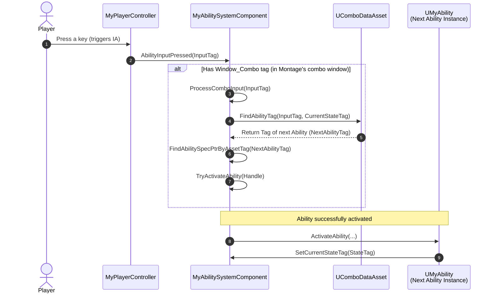
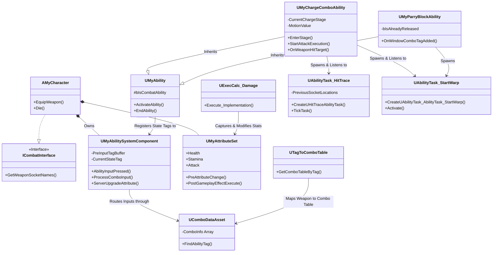
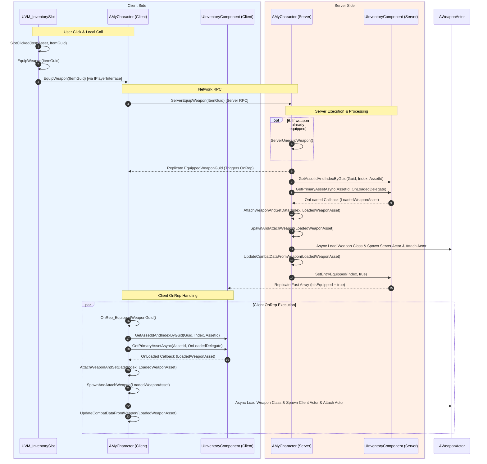
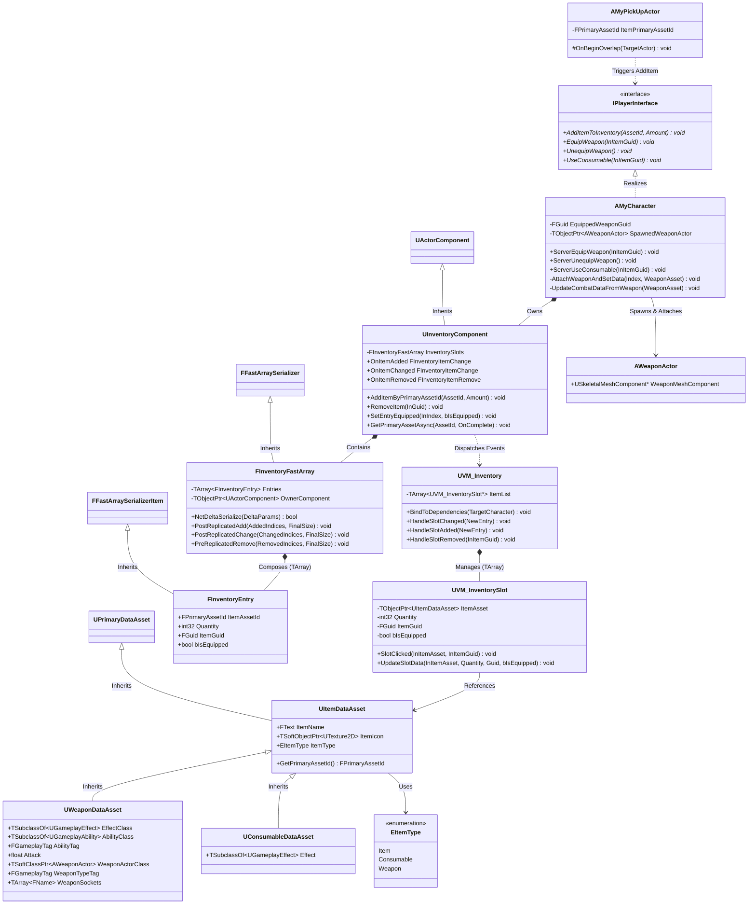

[日本語](README.md) | [English](README.en.md)

---
# 【UE5 / C++】マルチプレイアクションゲーム 技術実証プロトタイプ (GAS / MVVM / StateTree / FastArraySerializer)

コンシューマーおよびPC向けのマルチプレイアクションゲーム開発を想定し、Unreal Engine 5の主要フレームワーク（GAS、MVVM、StateTree）をC++ベースでネイティブ統合した技術実証プロトタイプです。

単なる機能実装にとどまらず、商用タイトルで求められる非機能要件を重視し、「Fast Array Serializerによる通信帯域の最適化」「FGameplayAbilityTargetDataを活用した低レイテンシなクライアント主導の攻撃判定」「オブジェクトプーリングやイベント駆動（省Tick）設計によるランタイム負荷の最小化」を追求しています。コアロジックをC++に集約してBlueprint仮想マシン（VM）のオーバーヘッドを排除し、拡張性の高い疎結合アーキテクチャと、プランナーの作業効率を考慮したデータ駆動型設計の両立を検証しています。

（[Fast Array Serializerインベントリ＆装備システムのシーケンス図](#-インベントリ装備システムinventory--equipment-system) ・ [データ駆動コンボシステムのシーケンス図](#️-自作コンボシステムcustom-combo-system)）  

<table width="100%">
  <tr>
    <td align="center" width="50%" valign="top">
      <br/>
      <b>ジャストガード → カウンター攻撃 → タメ攻撃</b>
    </td>
    <td align="center" width="50%" valign="top">
      <br/>
      <b>武器Combo Table動的切り替え ＆ Motion Warping</b>
    </td>
  </tr>
</table>

---

## **🎮 プロジェクト概要 / Project Overview**

* **Engine Version**: Unreal Engine 5.7 (C++)  
* **Genre**: Multiplayer Third-Person Action Game  
* **Target Platforms**: PC / Console  

### 🔑 主要技術スタックと実装概要 (Tech Stack & Implementation Overview)

* **疎結合アーキテクチャ設計**
  * `MVVM` | `Interface (C++)` | `Strategy (GAS)` | `Observer (Delegates)` | `SRP` | `Subsystem`
  * `OOPによるUI表現のポリモーフィズム`
    * 敵基底クラス: `ViewModel` の一元管理
    * 一般エネミー: `Widget Component` による頭上表示
    * ボス: インターフェース経由で `ViewModel` を取得し、プレイヤー HUD に表示

* **プランナーフレンドリー** & **データ駆動設計**
  * `自作データ駆動コンボシステム`: `UComboDataAsset`の編集のみでコンボルート構築可能
  * C++による基盤実装、BPはデータ・アセット設定に特化

* **イベント駆動** & **省Tick設計**
  * `StateTreeのイベント駆動型状態遷移`: 高負荷なTickの排除

* **ネットワーク同期の最適化**
  * `FastArraySerializer` によるインベントリ・装備レプリケーション
  * `送信データ量（ネットワーク帯域）の最適化`: アセットそのものではなく、アセットIDを同期

* **メモリ最適化**
  * `Flyweight パターン`: `UItemDataAsset` 等による不変データの共有
  * `ソフトポインタ（Soft Pointer）` | `アセットID`: 非同期ロードによるメモリフットプリント削減
  * `ウィークポインタ（Weak Pointer）`: 生存期間の異なるオブジェクト間の循環参照・クラッシュ防止

* **StateTreeによるAI意思決定**
  * `StateTree` | `Native Evaluators (C++)` | `AI Perception`

* **パフォーマンス・チューニング**
  * `オブジェクトプーリング`: `Widget Component` の頻繁な生成・破棄によるオーバーヘッド排除
  * BPノードの最小化による、VMオーバーヘッドの最適化

* **手触りとレスポンスの最適化**
  * `クライアント主導の攻撃判定` | `FGameplayAbilityTargetData`: 通信ラグによる「命中したのに不発扱いになる」現象を防止
  * `先行入力（インプットバッファ）のウィンドウ制御` | `コンボ受付ウィンドウ制御`
  * `ヒットストップ` | `Motion Warping`

---

## **🛠️ 主要システムの具體的な実装 / System Implementation Details**

### **1. ⚔️ 戦闘 & コンボシステム (Combat & Combo System)**
（詳細な**シーケンス図**は [こちら](#️-自作コンボシステムcustom-combo-system) をご確認ください。）
* **データ駆動型コンボシステム (Data-Driven Combo System)**: 
  C++ でカスタムのコンボテーブル検索システムを構築。装備した武器種に応じてコンボアセット（`UComboDataAsset`）を `UTagToComboTable` から取得して動的に切り替えます。
  * **プランナーフレンドリー**: プランナーはデータアセット上の編集のみで（`CurrentStateTag + InputTag` -> `NextAbilityTag`）、コンボルートを容易に追加・変更できます。  

<table width="100%">
  <tr>
    <td align="center" width="33%" valign="top">
      <br/>
      <b>コンボは2段のみ</b>
    </td>
    <td align="center" width="33%" valign="top">
      <br/>
      <b>Data Assetを編集</b>
    </td>
    <td align="center" width="33%" valign="top">
      <br/>
      <b>3段目コンボ追加</b>
    </td>
  </tr>
</table>

* **先行入力システム (Input Buffering)**:  
  先行入力受付ウィンドウ（`Window_PreInput`）中に検知した入力タグを一時的に `PreInputTagBuffer` にキャッシュ。コンボ入力許可ウィンドウ（`Window_Combo`）への移行と同時にキャッシュした入力タグはアビリティを即座に自動実行し、アクションゲームとしてのレスポンスと手触りを高めます。  

* **ソケットベースの攻撃判定 (Socket-based Hit Trace)**:  
  C++ でカスタムの `UAbilityTask_HitTrace` を実装。毎フレーム、武器に配置された複数の `Socket` の現在位置と前フレームの位置を比較し、その間を `Line Trace`（または `Sphere Trace`）で結ぶことで、高速な武器の振りに対応した攻撃判定を行います。  
  * **物理演算負荷の最小化**: キャラクター BP にアタッチされた物理コリジョンコンポーネントによる常時検知を排除。攻撃アニメーションのアクティブフレーム中のみ動的にトレースを実行するため、物理エンジンのオーバーヘッドを大幅に削減します。   

* **低レイテンシなクライアント主導攻撃判定 (Low-Latency Client-Authoritative Hit Trace)**:  
  前述の `UAbilityTask_HitTrace`において、攻撃判定はクライアント側でローカル（Client-Authoritative）に実行されます。「画面上では確実に斬撃がヒットしているのに、ネットワーク遅延やサーバー側との同期ズレによりヒットが却下される」というアクションゲーム特有の技術的課題を解決。ローカルで検知されたヒット結果を `FGameplayAbilityTargetData_SingleTargetHit` にパッケージングして `ServerSetReplicatedTargetData` を介してサーバーへ送信し、サーバー側で検証・ダメージ計算を行います。 

* **段階的タメ攻撃 (Multi-Stage Charged Attack)**:  
  `UMyChargeComboAbility` は 4 段階のタメ状態を管理。タイマー制御（`Stage2TimerHandle` ~ `Stage4TimerHandle`）によりタメ段階が上がるごとに、各段階に応じたビジュアル・サウンド（Cue）を起動。威力（`MotionValue`）にタメ段階に応じた威力補正（`MotionValueMultiplier`）を乗算し、 `SetByCaller` でダメージ計算式（`ExecCalc`）に引き渡します。  

* **パリィ・ガード＆カウンター (Parry, Block & Counter)**:  
  * **パリィからガードへの動的遷移**: `UMyParryBlockAbility` にて入力のホールド状態を監視。アニメーションが `Window_Combo` に達した際、入力を押し続けている場合は自動的にガードアビリティに移行し、ボタンを離している場合はパリィ演出を終了します。  
  * **カウンター駆動**: パリィ成功時に `Event_CounterSucceed` イベントを待ち受け、カウンターアビリティへと繋げます。

<table width="100%">
  <tr>
    <td align="center" width="50%" valign="top">
      <br/>
      <b>ジャストガード(パリィ) → カウンター攻撃 → タメ攻撃</b>
    </td>
    <td align="center" width="50%" valign="top">
      <br/>
      <b>武器Combo Table動的切り替え ＆ Motion Warping</b>
    </td>
  </tr>
</table>

### **2. 🎒 Fast Array Serializer を用いたインベントリ同期 (Inventory Replication)**
（詳細な**シーケンス図**は [こちら](#-インベントリ装備システムinventory--equipment-system) をご確認ください。）
* **送信データ量（パケットサイズ）の最適化**:  
  インベントリおよび装備システムには、UE 推奨の **Fast Array Serializer** を採用。パケットサイズの軽量化を図るため、アイテム情報の直接同期を避け、**Asset ID (`FPrimaryAssetId`)** と **Guid (`FGuid`)** のみをシリアライズして送受信（`FInventoryFastArray` & `FInventoryEntry`）します。これにより、マルチプレイ環境におけるネットワーク帯域を最適化。  

* **非同期読み込み & 安全なメモリライフサイクル**:  
  `UAssetManager`、`TSoftClassPtr`、`FPrimaryAssetId`を使用して、必要なアセットのみを非同期（Asynchronous Loading）でメモリ上に構築します。

<table width="100%">
  <tr>
    <td align="center" width="50%" valign="top">
      <br/>
      <b>ポーション使用＆武器装備</b>
    </td>
    <td align="center" width="50%" valign="top">
      <br/>
      <b>クライアント1の武器変更（クライアント2視点）</b>
    </td>
  </tr>
</table>

### **3. 🎯 パフォーマンス最適化 (Performance & Optimization)**

* **C++ 主導アビリティ設計 & キャッシュ最適化 (C++ Base Gameplay Ability)**:  
  すべての Gameplay Ability (GA) は C++ の `UMyAbility` を継承して構築されています。ブループリント内でノードを使用せず、GAを動作可能です。これにより、**Blueprint 仮想マシン（VM）の実行オーバーヘッドを排除**しています。
  * **プランナーフレンドリー**:デザイナーは Detail パネルで再生する Montage や攻撃力パラメータなどを指定するだけで調整可能です。
  * **キャストのキャッシュ化**: アビリティ実行時の処理負荷を軽減するため、`UMyAbility::OnAvatarSet` の段階で `AbilitySystemComponent` (ASC) をあらかじめメンバー変数 `MyAbilitySystemComponent` にキャッシュ。高頻度で実行される `ActivateAbility` 内での `Cast<T>` 処理負荷を排除しています。  

* **GC安全性を追求したスマートポインタ**:  
  ViewModel (`UVM_MyViewModelBase`) や非同期アセットローダーのラムダキャプチャ等において、`Model` への参照は `TWeakObjectPtr`（弱参照）で保持。生存期間が異なるオブジェクト間の循環参照を防止し、Unreal Engine のガベージコレクション（GC）が安全に動作するよう設計しています。  

* **コンポーネントプール・サブシステム (Widget Component Pooling Subsystem)**:  
  C++で実装したオリジナルのオブジェクトプール。ゲーム起動時（`AMyHUD::BeginPlay`）にダメージテキスト表示用の `Widget Component` を事前生成・プール化（`UDamageNumberPoolSubsystem::InitializePool`）し、`AvailablePool` と `InUsePool` 間で動的にリサイクルします。これにより、高頻度な Spawn / Destroy に伴う動的メモリ確保を排除し、**CPUスパイクおよびメモリ断片化（フラグメンテーション）を回避**しています。  

* **イベント駆動による省Tick化と疎結合 (Tickless Architecture & Loose Coupling)**:  
  AI コントローラー（`AMyAIController`）を含め、ゲーム内の主要オブジェクトの `Tick` を無効化。アビリティ終了時（`UMyAbility::EndAbility`）に C++ 側からライフサイクルイベント（`Event_Ability_Lifecycle_End`）を送信する、イベント駆動型アーキテクチャを実現しています。  
  * **敵AIの意思決定 (Event to StateTree Event)**: 敵キャラクター側のパッシブ GA がこの Gameplay Event を監視（Listen）し、検知した際に **StateTree イベント**へと変換・送信します。これにより、AI の状態遷移（State Transition）がトリガーされ、無駄な Tick ポーリングを排除した軽量なAI意思決定を実現しています。  
  * **プレイヤーキャラクターの設計 (Future-Proof Extensibility)**: プレイヤー側も同様にこのライフサイクルイベントを受信します（現状は特定の処理を行わない）。送信側（Ability）と受信側（Character）が疎結合化されているため、将来的にプレイヤー専用の拡張機能を実装する際も、既存の AI 側の設計を一切汚すことなく安全かつ容易に拡張できる設計を確立しています。


### **4. 📐 計算ロジック & クラス設計 (Calculation logic & Class design)**

* **ExecCalcによるダメージ計算の一元管理 (`UExecCalc_Damage`)**:  
  ダメージ計算ロジックを個々のキャラクターやアビリティから分離し、カスタムの `UGameplayEffectExecutionCalculation` 派生クラス (`UExecCalc_Damage`) 内で一括処理しています。  
  * **多様な戦闘要素の動的統合**: 攻撃側のステータスやGA固有の「モーション値（Motion Value）」に加え、ターゲット側の物理/属性防御力、物理素材（PhysMaterial）ベースの「部位別攻撃判定（頭・胴・足）」、さらに「クリティカル」「パリィ成功」「ガード」といったリアルタイムな戦闘状態を複合的に評価して最終ダメージを算出します。  
  * **拡張性（Scalability）**: 「属性の相性補正」「状態異常デバフ」「一時的な攻撃力バフ」といった複雑なダメージ計算ロジックも容易に追加・拡張可能な設計になっています。  

* **Custom Gameplay Effect Context (FMyGameplayEffectContext)**:  
  クリティカル（`bIsCriticalHit`）、パリィ（`bIsCountered`）、ガード（`bIsBlocked`）の状態データを伝達するため、`FGameplayEffectContext` を継承した `FMyGameplayEffectContext` を実装。NetSerialize をオーバーライドしてビットシリアライズを行うことで、ネットワークを跨ぐ安全なデータレプリケーションを行っています。

* **ポリモーフィズムとMVVMを融合した動的敵UIシステム (Polymorphic Enemy UI & Dynamic MVVM Binding)**:  
  オブジェクト指向設計（OOP）と多態性（Polymorphism）を活用し、敵のタイプや状況に応じてUI表現を切り替える、疎結合化された戦闘UIシステムを構築しました。  
  * **ViewModelの共通基盤管理**: 敵の共通基底クラス（`AMyEnemyBase`）で、HPなどのステータスを監視・通知する UI `ViewModel` (`UVM_CharacterStatus`) を初期化・保持します。  
  * **一般エネミー（Minions）の頭上UI**: 一般エネミーの派生クラスでは、アタッチされた`WidgetComponent`（HPバー）が、自身が持つ基底クラスの `ViewModel` にデータを直接バインドして自動更新します。  
  * **ボスエネミー（Bosses）はプレイヤーのHUD**: Bossに `IBossInterface` を実装。プレイヤー接近時に同インターフェース経由で `ViewModel` を取得することで、具体的なBossクラスへの依存を排除（疎結合化）します。プレイヤーのメイン HUD 下部に配置された「ボス専用大型HPゲージ」へ動的にバインドを切り替えることで、同一のデータ源（`ViewModel`）を再利用しながらUIのポリモーフィズムを実現しています。  

<table width="100%">
  <tr>
    <td align="center" width="33%" valign="top">
      <br/>
      <b>Boss&一般エネミーのHPバー</b>
    </td>
    <td align="center" width="33%" valign="top">
      <br/>
      <b>ステータス振り分けで攻撃力上昇</b>
    </td>
    <td align="center" width="33%" valign="top">
      <br/>
      <b>武器アビリティ：火球發射</b>
    </td>
  
  </tr>
</table>

### **5. ⚙️ その他のコアシステム / Other Core Systems**

* **キャラクター成長・ステータス振り分けシステム (Character Progression & Attributes)**
  * **レベルアップとステータス振り分け (Leveling & Attributes)**: 経験値（XP）に基づくレベルアップメカニクスを実装。レベルアップ時にプレイヤーは「Attribute Points」を獲得。
  * **主要/二次ステータスの動的スケーリング (Primary to Secondary Scaling)**: GASの `Attribute Set` を用いてキャラクターのステータスを管理。プレイヤーが**主要ステータス**（筋力 `Strength`、生命力 `Vitality`、敏捷性 `Dexterity`など）にポイントを振り分けると、システムが自動的かつ動的に**二次ステータス**（生命力による最大HPの増加、筋力による基礎攻撃力の向上など）を計算・反映し、拡張性の高いキャラクター育成システムを実現。

* **動的武器アビリティ＆イベント駆動メカニズム (Dynamic Weapon Abilities & Event-Driven Activation)**
  * **アビリティの動的付与・削除 (Dynamic Ability Granting)**: 武器アセットに特定のアビリティを紐付け、武器装備時に`ASC`（Ability System Component）へ該当アビリティを動的に付与し、装備解除時には安全に削除します。
  * **イベント駆動型アビリティ発動 (Event-Driven Execution)**: 攻撃モーション（剣の斬撃など）において、`AnimNotify` 経由で`Weapon Ability Event`を送信。コンボアビリティ側でこのイベントをリスン（受信）し、武器固有のスキルを動的にトリガー（例：斬撃の途中で剣先から火球を発射するなど）させることで、様々な派生コンボを実現。

* **データの永続化とセーブ/ロードシステム (Save/Load System)**
  * **USaveGame によるセーブ/ロード**: `USaveGame`を継承し、セーブ/ロードメカニズムを構築。
  * **進行状況およびインベントリの包括的セーブ (Save & Load Scope)**: 現在のキャラクターデータ（レベル、経験値、未割り当てステータスポイント、主要ステータス値） と、**インベントリ全体の所持品**（アイテムの`PrimaryAssetId`、スタック数、装備状態など）を統合した永続化保存に対応。

* **モーションワーピング (Motion Warping) による攻撃補正**
    * アクションの手触りを高めるため、キャラクターの入力方向に応じてターゲット方向への角度調整を行う `UAbilityTask_StartWarp` をC++で実装し、スムーズな移動・攻撃コンボ連携を実現。

* **ヒットストップ (Hit-Stop)**
    * 攻撃のヒット時にアビリティから `HitStopCue` (GameplayCue) をキック。キャラクターごとの CustomTimeDilation を制御し、打撃の手応え（ヒット感）を表現しています。

---

## **🏗️ アーキテクチャ概要（Architecture Overview）**

### **⚔️ 自作コンボシステム（Custom Combo System）**
* #### **⏳ シーケンス図（Sequence Diagram）**
[⬆ 本文へ戻る](#1-️-戦闘--コンボシステム-combat--combo-system) ・ [⬆ トップへ戻る](#ue5--cマルチプレイアクションゲーム-技術実証プロトタイプ-gas--mvvm--statetree--fastarrayserializer)


* #### **🧊 クラス図（Class Diagram）**
[⬆ 本文へ戻る](#1-️-戦闘--コンボシステム-combat--combo-system) ・ [⬆ トップへ戻る](#ue5--cマルチプレイアクションゲーム-技術実証プロトタイプ-gas--mvvm--statetree--fastarrayserializer)



### **🎒 インベントリ＆装備システム（Inventory & Equipment System）**
* #### **⏳ シーケンス図（Sequence Diagram）（Client Side）**
[⬆ 本文へ戻る](#2--fast-array-serializer-を用いたインベントリ同期-inventory-replication) ・ [⬆ トップへ戻る](#ue5--cマルチプレイアクションゲーム-技術実証プロトタイプ-gas--mvvm--statetree--fastarrayserializer)


* #### **🧊 クラス図（Class Diagram）**
[⬆ 本文へ戻る](#2--fast-array-serializer-を用いたインベントリ同期-inventory-replication) ・ [⬆ トップへ戻る](#ue5--cマルチプレイアクションゲーム-技術実証プロトタイプ-gas--mvvm--statetree--fastarrayserializer)


---

## **📂 ディレクトリ構成 / Directory Structure**
```
Source/MyProject/  
├── Public/
│   ├── AbilitySystem/       # GAS のコアコンポーネント（自作コンボシステムを含む）、カスタムAttributeSet、およびグローバル設定
│   │   ├── Abilities/       # 具体的なアビリティ（GA）。コンボ基底、タメ攻撃、回避、パリィ/ガード、プロジェクタイル発射スキルなど
│   │   ├── Data/            # コンボ表（Combo）、武器コンボ対応表（TagToCombo）、レベルアップ経験値（LevelUpInfo）などのデータアセット（DataAsset）
│   │   ├── ExecCalc/        # ダメージ計算ロジック（Execution Calculation）
│   │   └── Tasks/           # カスタムアビリティタスク。クライアント主導の攻撃判定（HitTrace）や位置/回転の動的補正（StartWarp）など
│   ├── Actor/               # ワールド上のベースActor（スキルから生成されるプロジェクタイルなど）
│   ├── AI/                  # AIコントローラー、StateTreeコンポーネント、およびカスタム角度エバリュエーター（TargetAngleEvaluator）
│   ├── Character/           # キャラクターロジックの基底および実装（プレイヤー/エネミー）。基本状態の管理やインターフェースの実装
│   ├── Cue/                 # バトルの視覚・聴覚フィードバックを制御するGameplay Cueロジック（ヒットストップ（HitStop）、溜めエフェクトなど）
│   ├── DamageNumber/        # 被弾時のダメージテキストを表示するコンポーネントまたはロジック
│   ├── Game/                # ゲームモード（GameMode）、グローバル定義（Gameplay Tagsの定義など）
│   ├── Input/               # カスタム Enhanced Input Component、Input Action を Gameplay Tag にマッピングするデータアセット
│   ├── Interaction/         # インターフェース（Interfaces）。バトル、エネミー、プレイヤーなどのコアインタラクション用
│   ├── Inventory/           # FastArraySerializer によるインベントリ
│   │   └── Data/            # アイテムや装備などのデータアセット
│   ├── Player/              # プレイヤーコントローラー（PlayerController）、プレイヤー状態（PlayerState）などのコアロジック
│   ├── SaveGame/            # ゲームの進行度セーブ/ロードに関するクラスおよびサブシステム
│   ├── UI/                  # HUD、View Model、Widget など
│   └── MyAbilityTypes.h     # カスタムGameplay Effect Context構造体およびGAS関連の型定義
└── Private/                 # ディレクトリ構造はpublicと同じ
```

---

## **🚀 今後のロードマップ / Future Roadmap**
 
* **StateTreeの強化**: 複数AIによる連携行動（包囲網、ヘイトシステム）の実裝。  
* **ターゲットロック**: ターゲットロック機能を実装する。  

## **👤 作成者情報 / Author Info**

* **氏名 (Name)**: 賴品睿 (らい　ぴんるい / Pin-Rui Lai)
* **職種 (Desired Position)**: ゲームプログラマー (Gameplay / System Programmer)  
* **居住地 (Location)**: Taiwan (引っ越し可能 / Open to Relocation)  
* **メールアドレス (Email)**: pinrui.lai.work@gmail.com  
* **対応言語 (Languages)**: 日本語 (JLPT N1)、英語 (TOEIC 745 / 日常会話レベル), 中国語 (母国語)
* **LinkedIn**: [https://www.linkedin.com/in/pin-rui-lai/](https://www.linkedin.com/in/pin-rui-lai/)